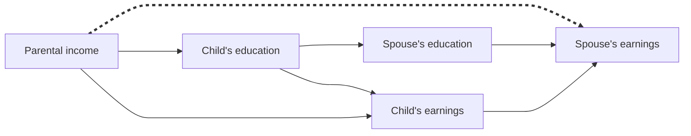

## Abstract

Adult children's labor market status and their type of marriage are major channels through which family advantages are passed from one generation to the next. However, these two routes are seldom studied together. We develop a theoretical approach to incorporate marriage entry and marital sorting into the intergenerational transmission of family income, accounting for differences between sons and daughters and considering education as a central explanatory factor. Using a novel decomposition method applied to data from the Panel Study of Income Dynamics, we find that marriage plays a major role in intergenerational transmission only among daughters and not until they reach their late-30s. This is more salient in the recent cohort in our data (people born 1963 to 1975). Marital status and marital sorting are comparably important in accounting for the role of marriage, but sorting becomes more important over cohorts. The increasing earnings returns to education over a husband's career and the weakening association between parental income and daughter's own earnings explain why marital sorting, and marriage overall, have been growing more important for intergenerational transmission from parents to their daughters.

## Notes

This study examines the overall role of marriage in the intergenerational transmission of family resources.
1. To what extent is the transmission of family (dis)advantages from parents to children attributable to children's marriage and to individual attainment in the labor market?
2. Given that marriage plays a role, how much of this is the result of whether someone marries and that of who someone marries?
3. How does the contribution of marriage vary over the life course, across birth cohorts, and between sons and daughters?

### Why does marriage matter?

Family origin and marital status
- Parents' income should be negatively associated with marriage entry when a child is young and positively associated as children age.

Family origin and marital sorting (educational links)
- Parental investment in education: parental income -> child's education
- Educational assortative mating: child's education -> spouse's education
- Earning returns to education: child/spouse's education -> child/spouse's earnings

Variations between genders, over the life course, and across cohorts
- The patterns of parental income stratification in marital status differ between men and women.
- Over the duration of marriages, marital sorting by earnings deviates from educational assortative mating.
- Changes in the links between parental income and child's spouse's earnings
	- Due to greater earnings returns to education among male spouses over the life course, the direct path will be strengthened for female children.
	- Due to daughters' own earnings becoming a poor indicator of their SES, the indirect path through child's own earnings will be suppressed, and that through marital sorting will be strengthened.
- Women’s own education will match better with their spouse’s earnings at older than younger ages, and this is likely particularly true for recent cohorts.

### A decomposition approach

