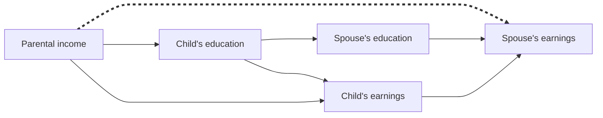

## Abstract

Adult children's labor market status and their type of marriage are major channels through which family advantages are passed from one generation to the next. However, these two routes are seldom studied together. We develop a theoretical approach to incorporate marriage entry and marital sorting into the intergenerational transmission of family income, accounting for differences between sons and daughters and considering education as a central explanatory factor. Using a novel decomposition method applied to data from the Panel Study of Income Dynamics, we find that marriage plays a major role in intergenerational transmission only among daughters and not until they reach their late-30s. This is more salient in the recent cohort in our data (people born 1963 to 1975). Marital status and marital sorting are comparably important in accounting for the role of marriage, but sorting becomes more important over cohorts. The increasing earnings returns to education over a husband's career and the weakening association between parental income and daughter's own earnings explain why marital sorting, and marriage overall, have been growing more important for intergenerational transmission from parents to their daughters.

## Notes

This study examines the overall role of marriage in the intergenerational transmission of family resources.
1. To what extent is the transmission of family (dis)advantages from parents to children attributable to children's marriage and to individual attainment in the labor market?
2. Given that marriage plays a role, how much of this is the result of whether someone marries and that of who someone marries?
3. How does the contribution of marriage vary over the life course, across birth cohorts, and between sons and daughters?

### Why does marriage matter?

Family origin and marital status
- Parents' income should be negatively associated with marriage entry when a child is young and positively associated as children age.

Family origin and marital sorting (educational links)
- Parental investment in education: parental income -> child's education
- Educational assortative mating: child's education -> spouse's education
- Earning returns to education: child/spouse's education -> child/spouse's earnings

Variations between genders, over the life course, and across cohorts
- The patterns of parental income stratification in marital status differ between men and women.
- Over the duration of marriages, marital sorting by earnings deviates from educational assortative mating.
- Changes in the links between parental income and child's spouse's earnings
	- Due to greater earnings returns to education among male spouses over the life course, the direct path will be strengthened for female children.
	- Due to daughters' own earnings becoming a poor indicator of their SES, the indirect path through child's own earnings will be suppressed, and that through marital sorting will be strengthened.
- Women’s own education will match better with their spouse’s earnings at older than younger ages, and this is likely particularly true for recent cohorts.

### A decomposition approach

$$\ln(y_{i})=\beta_{i0}+\beta_{ip}\ln(y_{p})+\varepsilon_{i}$$
- $y_{i}$ is child's individual earnings.
- $y_{p}$ is parents' income.
- $\beta_{ip}$ is the intergenerational elasticity (IGE) of earnings.

$$\ln(y_{c})=\beta_{c0}+\beta_{cp}\ln(y_{p})+\varepsilon_{c}$$
- $y_{c}$ is the sum of child's individual earnings and the child's spouse's earnings $y_{s}$.
	- For the married ($M=1$), $y_{c}=y_{i}+y_{s}$ and $\ln(y_{c})=\ln(y_{s})+\ln(\frac{y_{s}}{y_{i}+y_{s}})$
	- For the unmarried ($M=0$), $y_{c}=y_{i}$ and $\ln(y_{c})=\ln(y_{i})$
- $\beta_{cp}$ is the IGE for the child's family income.

$$\begin{align*}
\hat{\beta}_{cp} - \hat{\beta}_{ip} = & \underbrace{f_1(y_{p|M=0}, y_{p|M=1}, \operatorname{Pr}(M=1))}_{\text{(a) Parental income inequality in marital status (+)}} \\
& * \underbrace{(\ln(y_i + y_s) - \ln(y_i) | M = 1)}_{\text{(b) Average benefit of family income from being married}} \\
& + \underbrace{f_2(y_{p|M=0}, y_{p|M=1}, \operatorname{Pr}(M=1))}_{\text{(c) Parental income inequality in marital status (-)}} \\
& * \underbrace{g(\hat{\beta}_{ip}, \hat{b}_{si}, \hat{b}_{sp|i} | M = 1)}_{\text{(d) Parental income inequality through marital sorting}}
\end{align*}$$
- $\hat\beta_{cp}-\hat\beta_{ip}$ captures the contribution of marriage to the intergenerational transmission of family income.
- (a) and (c) show the extent to which two marital status groups differ in the mean and variance of parents' income.
	- (a) is an indicator of strong family origin stratification in marital status.
	- (c) is an indicator of weak family origin stratification in marital status.
- (b) captures the average family income gain through marriage.
	- (a) and (b) jointly reflect how family origin inequality in marital status is linked to child's family income (dis)advantage.
- (d) consists of a series of parameters each capturing some part of the association between parents' income and spouse's earnings.
	- $\hat b_{si}$ is the association between child's own earnings and spouse's earnings, together with $\hat \beta_{ip}$, denotes the indirect path from parents' income to spouse's earnings.
	- $\hat b_{sp|i}$ denotes the association between parents' income and spouse's earnings net of child's own earnings.

$\hat\beta_{cp}-\hat\beta_{ip}$ can be decomposed into:
1. Difference between married and unmarried people in the mean of their parents' income
2. Difference in the variance of their parents' income
3. The proportion who are married
4. The average gain in pooled couple income (b)
5. The IGE of child's individual earnings ($\hat \beta_{ip}$)
6. The association between parents' income and spouse's earnings ($\hat b_{si}$)
7. The association between parents' income and spouse's earnings net of child's earnings ($\hat b_{sp|i}$)

### Data and methods

Panel Study of Income Dynamics (PSID)
- Adult children born in two birth cohorts 1950-1962 and 1963-1975

Measures of income
- Parents' income: the average of total annual family incomes collected over children's ages 14-22
- Adult children/spouse's income: average *total money income from labor* between ages 27-34 and 35-42, excluding top-coded incomes
- Married means ever-married (maybe with different spouses), and unmarried means never-married

### Results

#### Overall role of marriage in intergenerational income mobility

All estimates of $\hat\beta_{cp}-\hat\beta_{ip}$ are very small and statistically indistinguishable from zero for men, suggesting a negligible role of marriage in the intergenerational transmission of family income for male children.

As daughters age, the IGE of their own earnings falls, but that of couples' income rises, suggesting the central role of marriage in the intergenerational transmission of family income for female children.

#### Decomposition: marital status and marital sorting

|                       |   Sons    |       |           |       | Daughters |       |           |       |
| --------------------- | :-------: | :---: | :-------: | :---: | :-------: | :---: | :-------: | :---: |
|                       | 1950-1962 |       | 1963-1975 |       | 1950-1962 |       | 1963-1975 |       |
|                       |   27-34   | 35-42 |   27-34   | 35-42 |   27-34   | 35-42 |   27-34   | 35-42 |
| (a)                   |   .017    | .045  |   .018    | .038  |   .034    | .104  |   .056    | .123  |
| (b)                   |   .385    | .529  |   .485    | .492  |   1.987   | 1.901 |   1.664   | 2.015 |
| (a) × (b)             |   .007    | .024  |   .009    | .019  |   .067    | .197  |   .093    | .247  |
| (c)                   |   .851    | .869  |   .832    | .844  |   .815    | .776  |   .757    | .675  |
| (d)                   |   -.056   | -.058 |   -.019   | -.056 |   -.073   | .035  |   -.154   | .271  |
| --Indirect path       |   -.171   | -.392 |   -.166   | -.163 |   -.369   | -.342 |   -.443   | -.198 |
| --Direct path         |   .115    | .334  |   .147    | .107  |   .296    | .377  |   .290    | .469  |
| (c) × (d)             |   -.048   | -.050 |   -.016   | -.047 |   -.059   | .027  |   -.116   | .183  |
| (a) × (b) + (c) × (d) |   -.041   | -.026 |   -.007   | -.028 |   .008    | .225  |   -.023   | .430* |
| N                     |    771    |  713  |    691    |  618  |    823    |  775  |    700    |  651  |

Substantially greater role for marital status in intergenerational income transfer for women, especially as they age.
- Parents' income is strongly stratified by marital status for women.
- The variance of parents' income is smaller for married daughters than for non-married ones.

|                                | 1950- 1962 | 1963-1975 |
| ------------------------------ | ---------: | --------: |
| Total contribution of marriage |       .225 |     .432* |
| Marital Status                 |     **84** |    **37** |
| % (a) × (b)                    |         88 |        57 |
| % (c)                          |         -4 |       -20 |
| Marital Sorting (d)            |     **16** |    **63** |
| % Indirect path:               |       -152 |       -46 |
| % Direct path:                 |        168 |       109 |
| Total                          |    **100** |   **100** |

Marital status matters more in the older cohort than in the younger.

#### The role of education

|                      |           |       Ages 27-34 |                  |                   |       Ages 35-42 |                  |                   |          Change |                  |                   |
| -------------------- | --------- | ---------------: | ---------------: | ----------------: | ---------------: | ---------------: | ----------------: | --------------: | ---------------: | ----------------: |
|                      |           |            Total | Net of Education | Through Education |            Total | Net of Education | Through Education |           Total | Net of Education | Through Education |
| Mean income relative | 1950-1962 |    .088 (100) |     .059 (67) |      .029 (33) | .260*** (100) |  .203*** (78) |     .057* (22) |  .172* (100) |    .144* (84) |      .028 (16) |
|                      | 1963-1975 |  .162** (100) |     .060 (37) |   .102*** (63) | .304*** (100) |   .174** (57) |   .130*** (43) |  .142* (100) |     .114 (80) |      .028 (20) |
| $\hat b_{sp\|i}$     | 1950-1962 |  .296** (100) |     .163 (55) |    .133** (45) |  .377** (100) |     .132 (35) |    .245** (65) |   .081 (100) |   -.032 (-39) |    .113* (139) |
|                      | 1963-1975 | .290*** (100) |     .178 (61) |     .112* (39) | .469*** (100) |     .248 (53) |    .221** (47) |   .180 (100) |     .071 (39) |     .109* (61) |
| $\hat \beta_{ip}$    | 1950-1962 |  .424** (100) |     .098 (23) |   .326*** (77) |   .395* (100) |     .108 (27) |   .286*** (73) |  -.029 (100) |    .010 (-36) |    -.039 (139) |
|                      | 1963-1975 | .501*** (100) |     .129 (26) |   .372*** (74) |    .220 (100) |   -.067 (-30) |  .287*** (130) | -.280* (100) |    -.196 (70) |     -.085 (30) |
| $\hat b_{si}$        | 1950-1962 | .130*** (100) |  .108*** (83) |     .022* (17) | .135*** (100) |  .116*** (86) |      .019 (14) |   .005 (100) |    .008 (144) |    -.002 (-44) |
|                      | 1963-1975 | .116*** (100) |   .088** (76) |     .027* (24) | .103*** (100) |   .087** (85) |      .016 (15) |  -.012 (100) |     -.001 (6) |     -.012 (94) |

For both cohorts, daughter's education plays only a minor role in explaining the emerging parental income advantage for marriage among women as they age, suggesting that the advance in education among women with disadvantaged origins waas not rewarded in the marriage market.

Spouse's education -> spouse's earnings is the primary drvier of the increased role of the direct path.
